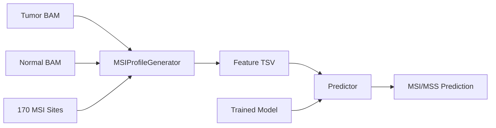

# STRiDE Architecture

## System Overview

STRiDE is a microsatellite instability (MSI) prediction pipeline for MSK-ACCESS cfDNA sequencing. It extracts repeat-frequency features from paired tumor/normal BAMs at 170 curated microsatellite loci, then classifies samples as MSI-H or MSS using a trained SGD classifier.

## Data Flow

## Module Map

| Module | Responsibility |
|--------|---------------|
| `cli.py` | Typer CLI with `features`, `predict`, `run` sub-commands |
| `feature_generator.py` | BAM parsing, repeat counting, statistical feature extraction |
| `predictor.py` | Model loading, feature matrix assembly, scoring |
| `pipeline.py` | Orchestration — single/batch feature → prediction flows |
| `utils.py` | Logging setup (`RichHandler`), filename helpers, sample-list I/O |
| `models/__init__.py` | `importlib.resources` helpers for bundled model/data |

## Feature Taxonomy (36+ per site)

Each of the 170 sites produces features in these categories:

- **Statistical**: chi-squared p-value, Shannon entropy (tumor/normal/diff)
- **Distance**: L1, L2, Wasserstein distance between normalized repeat distributions
- **Allele counts**: allele count differences at 7 absolute thresholds (1–30) and 6 normalized thresholds (1%–6%)
- **Quality metrics**: mean mapping quality, base quality (tumor/normal)
- **Insert sizes**: mean insert size (all/ref-matching/alt reads, tumor/normal)
- **Coverage**: raw and normalized repeat frequency distributions

## Model Architecture

The default model is an `sklearn.Pipeline`:
1. `StandardScaler` — feature normalization
2. `SGDClassifier` — stochastic gradient descent for MSI-H vs MSS

The `predictor.unwrap_model()` function handles multiple serialization formats (Pipeline, dict with `scaler`+`clf`, dict with `pipeline` key).

## Resource Management

- BAM files are managed via context managers (`MSIProfileGenerator.__enter__`/`__exit__`)
- Bundled data accessed via `importlib.resources.files()` for cross-platform compatibility
- Logging configured centrally by `utils.setup_logging()`, called once from the CLI layer
