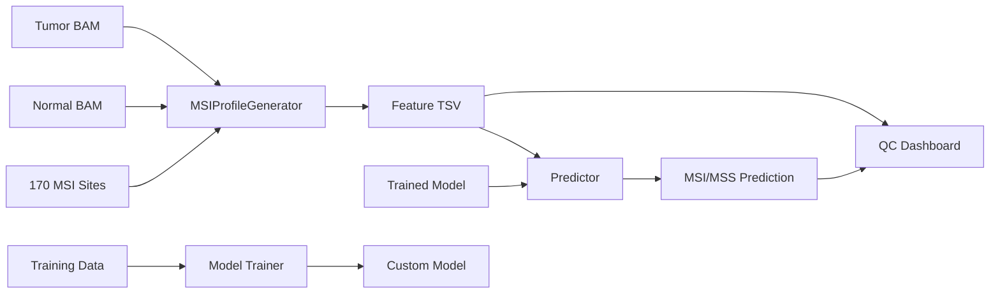

# STRiDE Architecture

## System Overview

STRiDE is a microsatellite instability (MSI) prediction pipeline for MSK-ACCESS cfDNA sequencing. It extracts repeat-frequency features from paired tumor/normal BAMs at 170 curated microsatellite loci, then classifies samples as MSI-H or MSS using trained ML models (default: SGD; also supports SVM, TabPFN).

## Data Flow



**Three main workflows:**
1. **Prediction** (default): Features → Model → Prediction
2. **QC Analysis** (optional): Features → Interactive Dashboard
3. **Model Training** (advanced): Cohort data → Train SVM/TabPFN → Custom model

## Module Map

| Module | Responsibility |
|--------|---------------|
| `cli.py` | Typer CLI with `features`, `predict`, `run`, `qc`, `train` sub-commands |
| `feature_generator.py` | BAM parsing, repeat counting, statistical feature extraction |
| `predictor.py` | Model loading, feature matrix assembly, scoring (SGD/SVM/TabPFN) |
| `qc.py` | Interactive Plotly dashboard, site explorer, expert QC review |
| `train.py` | SVM/TabPFN model training on labeled feature cohorts |
| `pipeline.py` | Orchestration — single/batch feature → prediction → QC flows |
| `utils.py` | Logging setup (`RichHandler`), filename helpers, sample-list I/O |
| `models/__init__.py` | `importlib.resources` helpers for bundled model/data |

## Feature Taxonomy (36+ per site)

Each of the 170 sites produces features in these categories:

- **Statistical**: chi-squared p-value, Shannon entropy (tumor/normal/diff)
- **Distance**: L1, L2, Wasserstein distance between normalized repeat distributions
- **Allele counts**: allele count differences at 7 absolute thresholds (1–30) and 6 normalized thresholds (1%–6%)
- **Quality metrics**: mean mapping quality, base quality (tumor/normal)
- **Insert sizes**: mean insert size (all/ref-matching/alt reads, tumor/normal)
- **Coverage**: raw and normalized repeat frequency distributions

## Model Architecture

STRiDE supports multiple classifiers:

**Default: SGD Classifier**
- `sklearn.Pipeline` with:
  1. `StandardScaler` — feature normalization
  2. `SGDClassifier` — stochastic gradient descent for MSI-H vs MSS
- Lightweight, fast inference

**Available Alternatives:**
- **SVM** — Support Vector Machine (linear or RBF kernel)
- **TabPFN** — Transformer-based Prior-Function Network (state-of-the-art on small datasets)

**Model Training:**
Train custom SVM/TabPFN models using `stride train`:
```bash
stride train --method svm --access-msi-dir /path/to/msi --access-mss-dir /path/to/mss
stride train --method tabpfn --access-msi-dir /path/to/msi --access-mss-dir /path/to/mss
```

**Training Report:**
By default, generates an interactive HTML report with:
- ROC curves, Precision-Recall curves
- Confusion matrices and per-class metrics
- Cross-validation performance distribution
- Feature importance visualization
- Threshold optimization curves
- Class balance analysis

Report location: `<out-dir>/training_report.html`

The `predictor.unwrap_model()` function handles multiple serialization formats (Pipeline, dict with `scaler`+`clf`, dict with `pipeline` key).

## Resource Management

- BAM files are managed via context managers (`MSIProfileGenerator.__enter__`/`__exit__`)
- Bundled data accessed via `importlib.resources.files()` for cross-platform compatibility
- Logging configured centrally by `utils.setup_logging()`, called once from the CLI layer

## QC Dashboard

The QC module generates interactive HTML reports for expert review:

- **Feature distributions**: Repeat-count histograms per site (tumor vs normal)
- **Site explorer**: Searchable table of all 170 sites with metrics
- **Distance visualization**: L1, L2, Wasserstein distance comparisons
- **MSI verdict**: Dashboard summary with prediction score and confidence
- **Tabulator.js integration**: Rich data table with filtering, sorting, export

Enable QC dashboard with:
```bash
stride run --qc
# or standalone:
stride qc --feature-tsv features.tsv --output report.html
```

## Nextflow Pipeline

For high-performance cluster execution (SLURM, SGE, etc.):

```bash
nextflow run stride/main.nf -profile slurm \
    --samples_list samples.csv \
    --out_dir results/
```

**Features:**
- Automatic resource allocation per sample
- Batch parallelization (feature generation)
- Integration with HPC schedulers
- Reproducible, containerized execution

See [Nextflow Guide](user-guide/nextflow.md) for details.

## Reporting Infrastructure

STRiDE generates interactive HTML reports across the pipeline:

**QC Dashboard** (`stride run --qc`)
- Feature distribution visualizations
- Site-level metrics and comparisons
- Expert review interface

**Training Report** (`stride train --report`)
- Model performance evaluation
- ROC/Precision-Recall curves
- Cross-validation analysis
- Feature importance
- Threshold optimization

Both reports use:
- **Plotly** for interactive charts (zoom, pan, hover tooltips)
- **Tabulator.js** for rich data tables
- **Self-contained HTML** (no external dependencies at runtime)
- **Export capabilities** (PNG, SVG, CSV)
