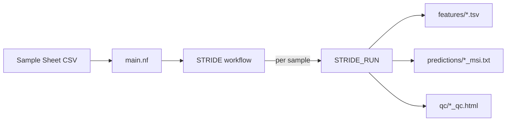

# Nextflow Pipeline

Run STRiDE at scale on HPC or cloud using the Nextflow DSL2 pipeline.

## Prerequisites

- [Nextflow](https://nextflow.io/) ≥ 23.04
- Docker **or** Singularity (for containerized execution)
- Alternatively, a local `stride` installation (`-profile local`)

## Quick Start

```bash
nextflow run nextflow/main.nf \
    --input samples.csv \
    --outdir results/ \
    -profile docker
```

## Sample Sheet

Use the same CSV format as [batch processing](batch.md):

```csv
sample_id,tumor_bam,normal_bam,matched_norm_sample_barcode
PATIENT_001,/data/P001_T.bam,/data/P001_N.bam,P001-N01-IM6
PATIENT_002,/data/P002_T.bam,/data/P002_N.bam,
```

| Column | Required | Description |
|--------|:--------:|-------------|
| `sample_id` | ✅ | Unique sample identifier |
| `tumor_bam` | ✅ | Path to tumor BAM |
| `normal_bam` | ✅ | Path to normal BAM |
| `matched_norm_sample_barcode` | ❌ | Explicit normal barcode (defaults to BAM basename) |

!!! note "BAI Index Discovery"
    BAI files are auto-discovered. Both naming conventions are supported:
    `sample.bam.bai` and `sample.bai`.

## Parameters

### Required

| Parameter | Description |
|-----------|-------------|
| `--input` | Sample sheet CSV |

### Optional

| Parameter | Default | Description |
|-----------|---------|-------------|
| `--outdir` | `results` | Output directory |
| `--site_list` | bundled 170-site | Custom MSI site list TSV |
| `--model_joblib` | bundled SGD model | Custom trained model |
| `--min_coverage` | `20` | Minimum read coverage per site |
| `--max_repeat_bins` | `100` | Maximum repeat-count bins |
| `--generate_qc` | `true` | Generate interactive QC HTML report |
| `--stride_version` | `latest` | Container image version tag |

## Profiles

Select a profile with `-profile <name>`:

| Profile | Container | Executor | Use Case |
|---------|-----------|----------|----------|
| `docker` | Docker | Local | Local development, CI |
| `singularity` | Singularity | Local | HPC without Docker |
| `slurm` | Singularity | SLURM (`cmobic_cpu`) | MSKCC HPC cluster |
| `local` | None | Local | `stride` installed locally |
| `test` | — | — | CI validation (minimal resources) |
| `debug` | — | — | Prints hostname before each task |

Profiles can be combined:

```bash
# SLURM on MSKCC cluster
nextflow run nextflow/main.nf \
    --input samples.csv \
    --outdir results/ \
    -profile slurm

# Local development (no container)
nextflow run nextflow/main.nf \
    --input samples.csv \
    --outdir results/ \
    -profile local

# CI test
nextflow run nextflow/main.nf \
    -profile test,docker \
    --outdir test_results/
```

## Output Structure

```
results/
├── stride/
│   ├── features/
│   │   └── msi_features_PATIENT_001.tsv
│   ├── predictions/
│   │   └── PATIENT_001_msi.txt
│   └── qc/
│       └── PATIENT_001_qc.html
└── pipeline_info/
    ├── execution_trace.txt
    ├── execution_report.html
    ├── execution_timeline.html
    └── pipeline_dag.svg
```

## Pipeline Architecture



Each sample is processed **independently** and in **parallel** — Nextflow handles scheduling, retries, and resource management.

### Modules

| Module | CLI Command | Use Case |
|--------|-------------|----------|
| `STRIDE_RUN` | `stride run` | **Primary** — full pipeline per sample |
| `STRIDE_FEATURES` | `stride features` | Standalone feature extraction |
| `STRIDE_PREDICT` | `stride predict` | Re-predict with different model |
| `STRIDE_QC` | `stride qc` | Regenerate QC from existing features |

## Resource Management

The pipeline automatically retries failed tasks on OOM/SIGKILL (exit codes 137, 143).
Resources scale with retry attempts:

| Module | CPUs | Memory | Time |
|--------|:----:|:------:|:----:|
| `STRIDE_RUN` | 2 × attempt | 8 GB × attempt | 2h × attempt |
| `STRIDE_FEATURES` | 2 × attempt | 8 GB × attempt | 2h × attempt |
| `STRIDE_PREDICT` | 1 | 2 GB × attempt | 30m × attempt |
| `STRIDE_QC` | 1 | 2 GB × attempt | 30m × attempt |

Override maximum limits:

```bash
nextflow run nextflow/main.nf \
    --input samples.csv \
    --max_cpus 8 \
    --max_memory 32.GB \
    -profile slurm
```

## Execution Reports

Every run generates monitoring files in `results/pipeline_info/`:

| File | Description |
|------|-------------|
| `execution_trace.txt` | Per-task resource usage (CPU, memory, duration) |
| `execution_report.html` | Interactive HTML summary |
| `execution_timeline.html` | Gantt chart of task execution |
| `pipeline_dag.svg` | Workflow DAG visualization |

## Custom Container

Pin a specific STRiDE version for reproducibility:

```bash
nextflow run nextflow/main.nf \
    --input samples.csv \
    --stride_version 0.1.0 \
    -profile docker
```

The container is pulled from `ghcr.io/msk-access/stride:<version>`.

## Singularity on HPC

For HPC environments without Docker:

```bash
# Pull and cache the container
singularity pull docker://ghcr.io/msk-access/stride:latest

# Run with Singularity profile
nextflow run nextflow/main.nf \
    --input samples.csv \
    --outdir results/ \
    -profile singularity
```

!!! tip "MSKCC Users"
    Use `-profile slurm` which automatically enables Singularity and submits to the `cmobic_cpu` queue.
